# HED search benchmark report

**Run:** 20260901_140959  

**Mode:** quick

## Overview

This report compares the performance of the three HED string search engines provided by the `hedtools` package:

1. **basic_search** (`hed.models.basic_search.find_matching`) - regex-based pattern matching that operates directly on a `pd.Series` of raw HED strings. No schema required. Supports simple boolean AND (`@`), negation (`~`), wildcards (`*`), and parenthesised groups.
2. **QueryHandler** (`hed.models.query_handler.QueryHandler`) - full expression-tree search that operates on parsed `HedString` objects. Requires a loaded HED schema. Supports AND, OR, negation, exact groups `{}`, optional exact `{:}`, logical groups `[]`, wildcard child `?`/`??`/`???`, descendant wildcards, and quoted exact matches.
3. **String search** (`hed.models.string_search.StringQueryHandler`) - lightweight tree-based search that operates on raw strings via `StringNode` duck-typing. Schema is optional (via `schema_lookup` dict for ancestor queries). Provides `string_search()` convenience function for a plain `list[str]`. Same query syntax as Object search.

### Engine capability matrix

| Feature | Basic search | Object search | String search |
| --- | --- | --- | --- |
| Input type | `pd.Series[str]` | `HedString` objects | Raw strings (`str`) |
| Schema required | No | Yes | Optional (via `schema_lookup`) |
| Batch API | `find_matching(series, query)` | Manual loop | `string_search(strings, query)` |
| Boolean AND | `word1, word2` | `term1 && term2` | same as Object search |
| Boolean OR | - | `term1 || term2` | same as Object search |
| Negation | `~word` | `~term` | same as Object search |
| Exact group `{}` | - | `{term1, term2}` | same as Object search |
| Optional exact `{:}` | - | `{term1, term2:}` | same as Object search |
| Logical group `[]` | - | `[term1, term2]` | same as Object search |
| Wildcard `?/?? /???` | - | Yes | same as Object search |
| Descendant wildcard | `*` suffix | `*` suffix | same as Object search |
| Quoted exact match | - | `"Exact-tag"` | same as Object search |
| Implementation | Regex on text | Recursive tree on parsed nodes | Recursive tree on StringNode |

## Benchmark query suite

All 18 operations below are used across the benchmarks. The **single-string** and **series** benchmarks use the 12-query core set (the Core column); the **per-operation sweep** uses all 18 on a fixed structured string; **nesting-depth sweeps** use the 5-query subset in the Depth column.

| Category | Label | Object search / String search query | Basic search query | Core | Depth |
| --- | --- | --- | --- | :---: | :---: |
| Simple | `bare_term` | `Event` | `@Event` | yes | yes |
| Simple | `exact_quoted` | `"Event"` (quoted exact match) | - unsupported | yes | |
| Simple | `wildcard_prefix` | `Def/*` | `Def/*` | yes | |
| Boolean | `and_2` | `Event && Action` | `@Event, @Action` | yes | yes |
| Boolean | `and_3` | `Event && Action && Agent` | `@Event, @Action, @Agent` | yes | |
| Boolean | `deep_and_chain` | `Event && Action && Agent && Item && Red` | `@Event, @Action, @Agent, @Item, @Red` | | |
| Boolean | `or` | `Event \|\| Action` | - unsupported | yes | |
| Boolean | `negation` | `~Event` | `~Event` | yes | yes |
| Boolean | `double_negation` | `~(~Event)` | - unsupported | | |
| Boolean | `nested_or_and` | `(Event \|\| Sensory-event) && (Action \|\| Agent)` | - unsupported | | |
| Group structural | `group_nesting` | `[Event && Action]` | `(Event, Action)` | yes | yes |
| Group structural | `exact_group` | `{Event && Action}` | - unsupported | yes | yes |
| Group structural | `exact_group_optional` | `{Event && Action: Agent}` | - unsupported | yes | |
| Group structural | `wildcard_?` | `{Event, ?}` | - unsupported | yes | |
| Group structural | `wildcard_??` | `{Event, ??}` | - unsupported | | |
| Group structural | `wildcard_???` | `{Event, ???}` | - unsupported | | |
| Complex | `descendant_nested` | `[Def && Onset]` | - unsupported | | |
| Complex | `complex_composite` | `{(Onset \|\| Offset), (Def \|\| {Def-expand}): ???}` | - unsupported | yes | |

## Key findings

- **Batch throughput:** Basic search is ~15x faster than Object search in a row-by-row loop at 5,000 rows, because it leverages vectorised pandas `str.contains` regex matching.

- **Single-string speed:** String search (no lookup) is ~22% faster than Object search per string because it avoids schema-based `HedString` construction and uses lightweight string parsing.

- **Schema-lookup overhead:** Enabling `schema_lookup` in String search adds ~79% overhead for ancestor-based queries.

- **Nesting depth (Object search):** At depth 20, search time is ~5.0x the flat-string time.

- **Nesting depth (String search (lookup)):** At depth 20, search time is ~26.2x the flat-string time.

- **Operation coverage:** Basic search supports 7 of 18 tested operations. The remaining 11 operations (OR, exact groups, logical groups, wildcards `?`/`??`/`???`, quoted terms) require Object search or String search.

## Single-string performance

Each of the 12 core queries (see Benchmark query suite above) was applied to a single HED string of varying complexity. Times are medians of repeated runs, in milliseconds.

|  | Basic search | Object search | String search | String search (lookup) |
| --- | --- | --- | --- | --- |
| large_25tag / complex_composite | - | 0.119 | 0.090 | 0.095 |
| large_25tag / exact_group | - | 0.091 | 0.062 | 0.062 |
| large_25tag / exact_group_optional | - | 0.097 | 0.072 | 0.071 |
| large_25tag / group_nesting | 0.262 | 0.149 | 0.090 | 0.075 |
| large_25tag / negation | 0.200 | 0.096 | 0.168 | 0.149 |
| large_25tag / single_bare_term | 0.107 | 0.089 | 0.059 | 0.058 |
| large_25tag / single_exact_term | - | 0.090 | 0.057 | 0.056 |
| large_25tag / single_wildcard | 0.106 | 0.089 | 0.078 | 0.068 |
| large_25tag / three_term_and | 0.230 | 0.091 | 0.063 | 0.063 |
| large_25tag / two_term_and | 0.183 | 0.094 | 0.061 | 0.060 |
| large_25tag / two_term_or | - | 0.104 | 0.064 | 0.070 |
| large_25tag / wildcard_child | - | 0.088 | 0.083 | 0.064 |
| medium_10tag / complex_composite | - | 0.058 | 0.046 | 0.047 |
| medium_10tag / exact_group | - | 0.035 | 0.026 | 0.026 |
| medium_10tag / exact_group_optional | - | 0.040 | 0.032 | 0.031 |
| medium_10tag / group_nesting | 0.111 | 0.035 | 0.026 | 0.025 |
| medium_10tag / negation | 0.243 | 0.035 | 0.051 | 0.025 |
| medium_10tag / single_bare_term | 0.098 | 0.030 | 0.020 | 0.020 |
| medium_10tag / single_exact_term | - | 0.032 | 0.030 | 0.092 |
| medium_10tag / single_wildcard | 0.398 | 0.099 | 0.027 | 0.028 |
| medium_10tag / three_term_and | 0.217 | 0.036 | 0.026 | 0.025 |
| medium_10tag / two_term_and | 0.159 | 0.034 | 0.023 | 0.024 |
| medium_10tag / two_term_or | - | 0.036 | 0.025 | 0.027 |
| medium_10tag / wildcard_child | - | 0.041 | 0.027 | 0.026 |
| small_5tag / complex_composite | - | 0.038 | 0.034 | 0.032 |
| small_5tag / exact_group | - | 0.021 | 0.016 | 0.016 |
| small_5tag / exact_group_optional | - | 0.027 | 0.022 | 0.021 |
| small_5tag / group_nesting | 0.115 | 0.021 | 0.017 | 0.016 |
| small_5tag / negation | 0.194 | 0.020 | 0.013 | 0.014 |
| small_5tag / single_bare_term | 0.105 | 0.017 | 0.011 | 0.010 |
| small_5tag / single_exact_term | - | 0.017 | 0.011 | 0.017 |
| small_5tag / single_wildcard | 0.102 | 0.018 | 0.012 | 0.012 |
| small_5tag / three_term_and | 0.224 | 0.022 | 0.016 | 0.016 |
| small_5tag / two_term_and | 0.167 | 0.019 | 0.014 | 0.015 |
| small_5tag / two_term_or | - | 0.023 | 0.014 | 0.016 |
| small_5tag / wildcard_child | - | 0.021 | 0.016 | 0.015 |
| tiny_1tag / complex_composite | - | 0.031 | 0.028 | 0.028 |
| tiny_1tag / exact_group | - | 0.014 | 0.017 | 0.011 |
| tiny_1tag / exact_group_optional | - | 0.019 | 0.016 | 0.016 |
| tiny_1tag / group_nesting | 0.125 | 0.015 | 0.012 | 0.010 |
| tiny_1tag / negation | 0.209 | 0.011 | 0.008 | 0.008 |
| tiny_1tag / single_bare_term | 0.108 | 0.011 | 0.008 | 0.006 |
| tiny_1tag / single_exact_term | - | 0.009 | 0.007 | 0.008 |
| tiny_1tag / single_wildcard | 0.101 | 0.008 | 0.006 | 0.006 |
| tiny_1tag / three_term_and | 0.240 | 0.013 | 0.011 | 0.010 |
| tiny_1tag / two_term_and | 0.156 | 0.011 | 0.008 | 0.008 |
| tiny_1tag / two_term_or | - | 0.011 | 0.009 | 0.009 |
| tiny_1tag / wildcard_child | - | 0.013 | 0.011 | 0.011 |
| xlarge_50tag / complex_composite | - | 0.433 | 0.267 | 0.205 |
| xlarge_50tag / exact_group | - | 0.177 | 0.109 | 0.110 |
| xlarge_50tag / exact_group_optional | - | 0.168 | 0.117 | 0.188 |
| xlarge_50tag / group_nesting | 0.110 | 0.164 | 0.110 | 0.121 |
| xlarge_50tag / negation | 0.205 | 0.274 | 0.123 | 0.118 |
| xlarge_50tag / single_bare_term | 0.116 | 0.156 | 0.105 | 0.106 |
| xlarge_50tag / single_exact_term | - | 0.167 | 0.104 | 0.136 |
| xlarge_50tag / single_wildcard | 0.114 | 0.166 | 0.110 | 0.109 |
| xlarge_50tag / three_term_and | 0.242 | 0.159 | 0.463 | 0.352 |
| xlarge_50tag / two_term_and | 0.173 | 0.155 | 0.111 | 0.108 |
| xlarge_50tag / two_term_or | - | 0.178 | 0.111 | 0.122 |
| xlarge_50tag / wildcard_child | - | 0.156 | 0.116 | 0.109 |

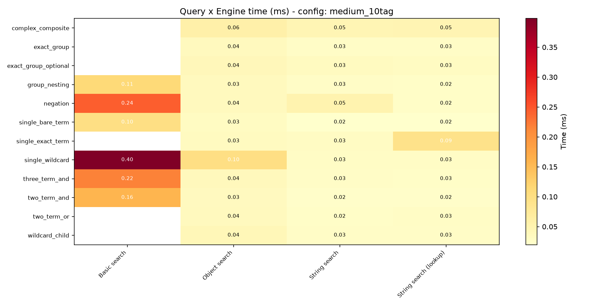

## Row-by-row search scaling

Whole-list search: each engine processes all items in a list of strings for a given query. Basic search uses vectorised regex on a `pd.Series`; String search uses `StringQueryHandler.search()` per item on a plain list; Object search constructs a `HedString` per row then searches. Times in milliseconds.

|  | Basic search | Object search | String search | String search (lookup) |
| --- | --- | --- | --- | --- |
| hetero_100 / complex_composite | - | 4.836 | 3.634 | 5.365 |
| hetero_100 / exact_group | - | 4.622 | 3.038 | 3.262 |
| hetero_100 / exact_group_optional | - | 5.363 | 3.207 | 7.853 |
| hetero_100 / group_nesting | 0.259 | 4.797 | 2.997 | 4.786 |
| hetero_100 / negation | 0.518 | 4.837 | 3.234 | 3.228 |
| hetero_100 / single_bare_term | 0.635 | 4.024 | 2.826 | 3.514 |
| hetero_100 / single_exact_term | - | 4.984 | 2.816 | 2.752 |
| hetero_100 / single_wildcard | 0.347 | 6.465 | 3.318 | 2.985 |
| hetero_100 / three_term_and | 0.974 | 3.738 | 2.298 | 3.128 |
| hetero_100 / two_term_and | 1.245 | 5.306 | 2.606 | 2.897 |
| hetero_100 / two_term_or | - | 5.123 | 2.828 | 3.612 |
| hetero_100 / wildcard_child | - | 4.067 | 2.412 | 2.854 |
| homo_10 / complex_composite | - | 0.338 | 0.251 | 0.254 |
| homo_10 / exact_group | - | 0.363 | 0.194 | 0.194 |
| homo_10 / exact_group_optional | - | 0.288 | 0.219 | 0.217 |
| homo_10 / group_nesting | 0.295 | 0.282 | 0.228 | 0.196 |
| homo_10 / negation | 0.671 | 0.290 | 0.434 | 0.203 |
| homo_10 / single_bare_term | 0.192 | 0.295 | 0.217 | 0.199 |
| homo_10 / single_exact_term | - | 0.288 | 0.213 | 0.186 |
| homo_10 / single_wildcard | 0.190 | 0.293 | 0.209 | 0.189 |
| homo_10 / three_term_and | 0.350 | 0.272 | 0.201 | 0.197 |
| homo_10 / two_term_and | 0.257 | 0.285 | 0.245 | 0.196 |
| homo_10 / two_term_or | - | 0.299 | 0.201 | 0.216 |
| homo_10 / wildcard_child | - | 0.260 | 0.188 | 0.190 |
| homo_100 / complex_composite | - | 3.653 | 2.412 | 2.469 |
| homo_100 / exact_group | - | 3.132 | 2.575 | 2.050 |
| homo_100 / exact_group_optional | - | 3.126 | 1.932 | 2.150 |
| homo_100 / group_nesting | 0.162 | 2.884 | 1.928 | 1.992 |
| homo_100 / negation | 0.564 | 2.894 | 2.161 | 2.032 |
| homo_100 / single_bare_term | 0.340 | 2.759 | 1.886 | 1.925 |
| homo_100 / single_exact_term | - | 2.987 | 1.762 | 1.874 |
| homo_100 / single_wildcard | 0.392 | 2.771 | 1.973 | 1.810 |
| homo_100 / three_term_and | 0.910 | 3.527 | 1.897 | 2.961 |
| homo_100 / two_term_and | 0.658 | 2.955 | 2.935 | 2.002 |
| homo_100 / two_term_or | - | 3.270 | 1.919 | 2.240 |
| homo_100 / wildcard_child | - | 6.897 | 1.889 | 4.018 |
| homo_500 / complex_composite | - | 22.386 | 12.546 | 12.557 |
| homo_500 / exact_group | - | 16.979 | 12.643 | 12.973 |
| homo_500 / exact_group_optional | - | 24.676 | 10.485 | 11.830 |
| homo_500 / group_nesting | 0.509 | 17.962 | 10.034 | 11.592 |
| homo_500 / negation | 1.390 | 17.296 | 14.383 | 12.146 |
| homo_500 / single_bare_term | 1.011 | 15.958 | 9.858 | 10.593 |
| homo_500 / single_exact_term | - | 16.380 | 8.863 | 9.981 |
| homo_500 / single_wildcard | 1.049 | 16.078 | 10.047 | 9.630 |
| homo_500 / three_term_and | 3.187 | 16.826 | 14.324 | 10.644 |
| homo_500 / two_term_and | 2.367 | 16.408 | 9.801 | 11.355 |
| homo_500 / two_term_or | - | 18.528 | 12.208 | 11.753 |
| homo_500 / wildcard_child | - | 21.219 | 10.216 | 14.605 |

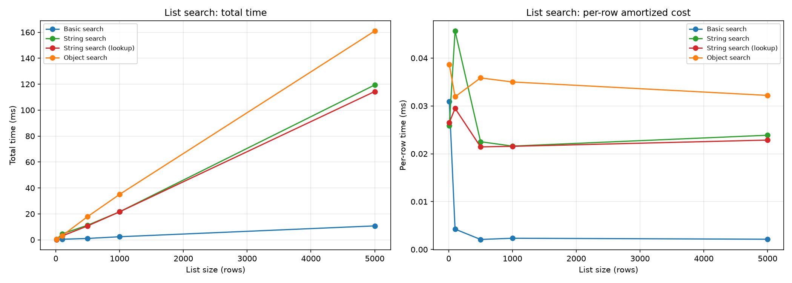

## Factor sweeps

Each sweep varies a single factor while holding others constant, measuring how performance degrades.

### Compile Vs Search

Decomposition of one-time query compilation cost vs per-string search cost. Compilation is cheap for both engines; the per-search cost dominates.

|  | Object search | String search |
| --- | --- | --- |
| compile | 0.005 | 0.005 |
| search | 0.060 | 0.038 |

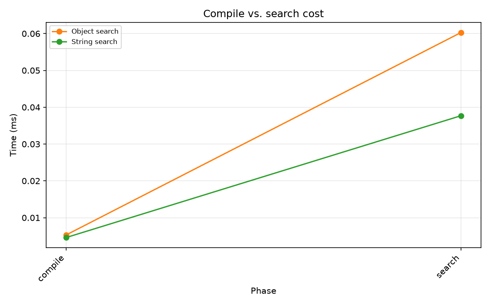

### Deep Nest Bare Term

Deep nesting sweep for *bare term* queries at depths 1-20. Shows how nesting interacts with specific query patterns.

|  | Basic search | Object search | String search | String search (lookup) |
| --- | --- | --- | --- | --- |
| 1 | 0.248 | 0.021 | 0.013 | 0.013 |
| 5 | 0.240 | 0.069 | 0.042 | 0.032 |
| 10 | 0.242 | 0.078 | 0.059 | 0.050 |
| 20 | 0.168 | 0.143 | 0.139 | 0.161 |

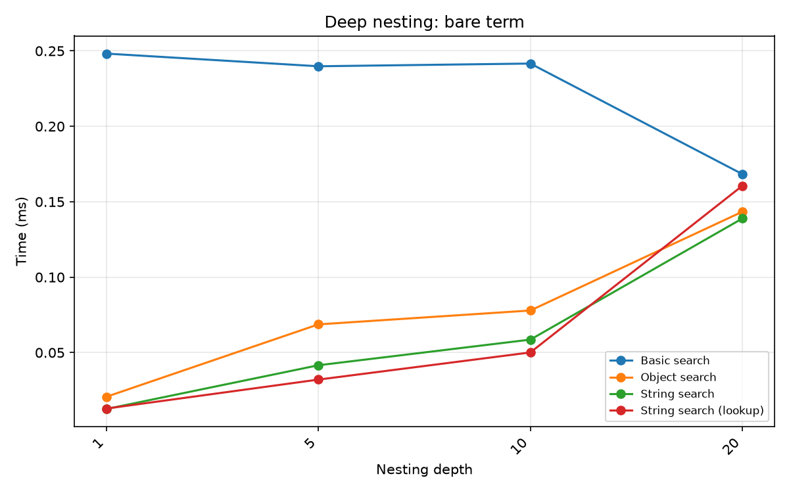

### Deep Nest Exact Group

Deep nesting sweep for *exact group* queries at depths 1-20. Shows how nesting interacts with specific query patterns.

|  | Object search | String search | String search (lookup) |
| --- | --- | --- | --- |
| 1 | 0.036 | 0.026 | 0.025 |
| 5 | 0.075 | 0.054 | 0.053 |
| 10 | 0.123 | 0.083 | 0.059 |
| 20 | 0.378 | 0.139 | 0.133 |

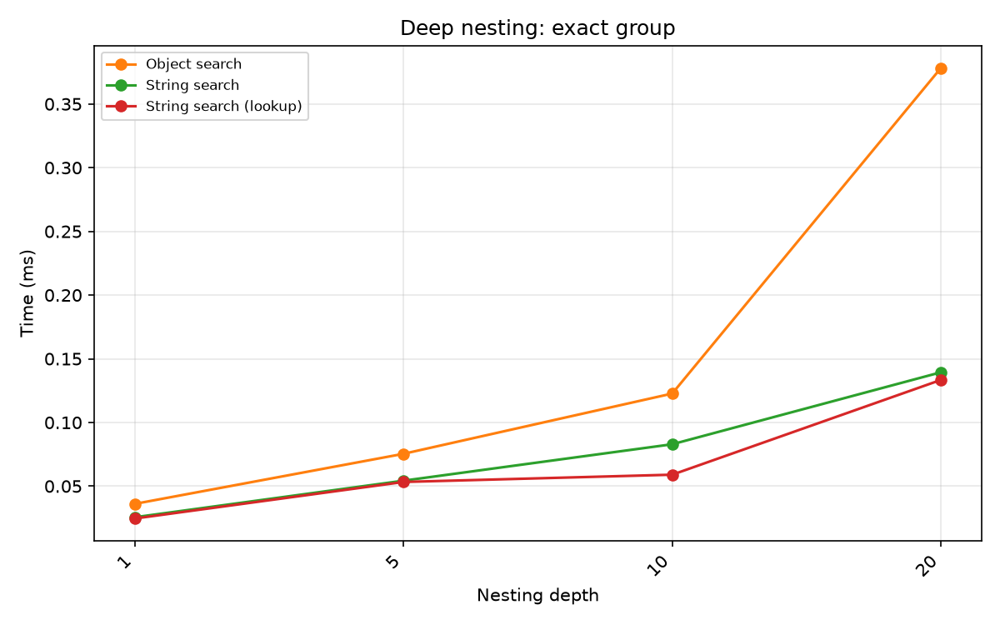

### Deep Nest Group Match

Deep nesting sweep for *group match* queries at depths 1-20. Shows how nesting interacts with specific query patterns.

|  | Basic search | Object search | String search | String search (lookup) |
| --- | --- | --- | --- | --- |
| 1 | 0.531 | 0.039 | 0.029 | 0.026 |
| 5 | 0.523 | 0.103 | 0.063 | 0.080 |
| 10 | 0.622 | 0.139 | 0.089 | 0.105 |
| 20 | 0.716 | 0.438 | 0.203 | 0.332 |

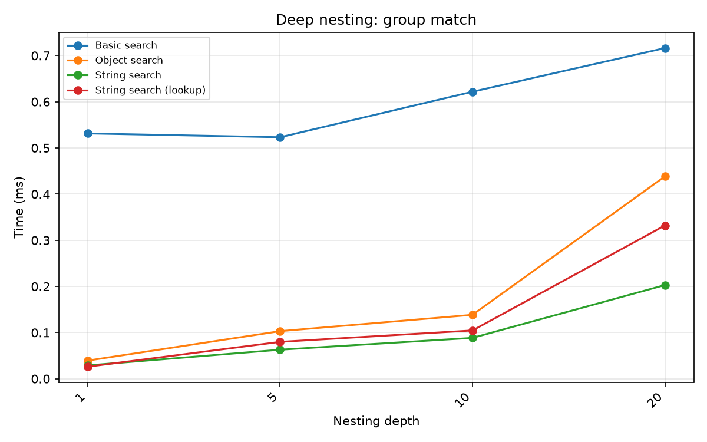

### Deep Nest Negation

Deep nesting sweep for *negation* queries at depths 1-20. Shows how nesting interacts with specific query patterns.

|  | Basic search | Object search | String search | String search (lookup) |
| --- | --- | --- | --- | --- |
| 1 | 0.134 | 0.031 | 0.020 | 0.019 |
| 5 | 0.137 | 0.074 | 0.051 | 0.048 |
| 10 | 0.101 | 0.082 | 0.058 | 0.060 |
| 20 | 0.144 | 0.297 | 0.187 | 0.258 |

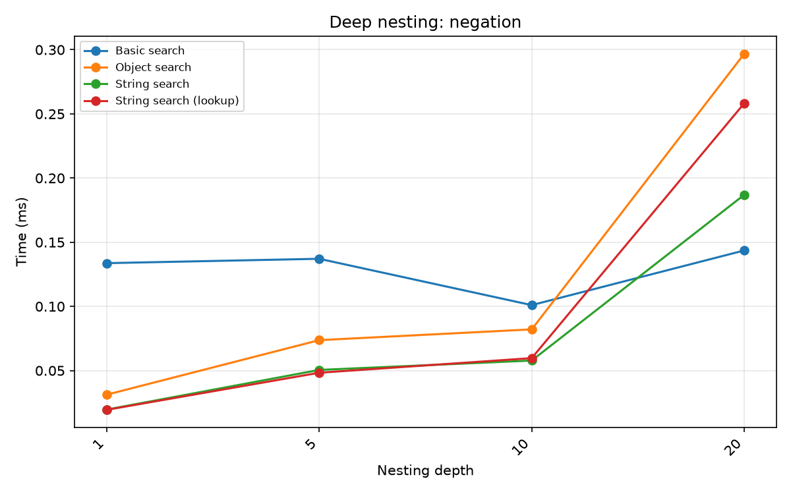

### Deep Nest Two And

Deep nesting sweep for *two and* queries at depths 1-20. Shows how nesting interacts with specific query patterns.

|  | Basic search | Object search | String search | String search (lookup) |
| --- | --- | --- | --- | --- |
| 1 | 0.252 | 0.026 | 0.019 | 0.017 |
| 5 | 0.242 | 0.070 | 0.038 | 0.056 |
| 10 | 0.248 | 0.099 | 0.089 | 0.105 |
| 20 | 0.442 | 0.412 | 0.190 | 0.323 |

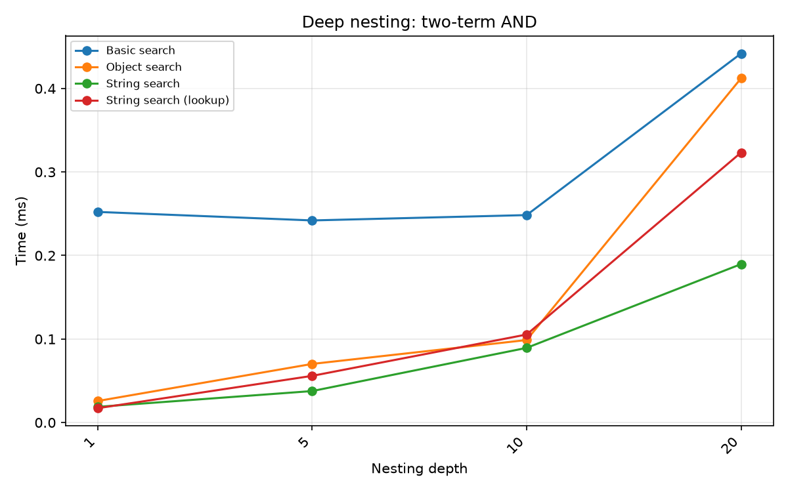

### Group Count

Number of parenthesised groups (1 to 20). More groups mean more children at the top level for tree traversal.

|  | Basic search | Object search | String search | String search (lookup) |
| --- | --- | --- | --- | --- |
| 0 | 0.164 | 0.036 | 0.022 | 0.022 |
| 1 | 0.148 | 0.038 | 0.025 | 0.026 |
| 5 | 0.146 | 0.049 | 0.033 | 0.025 |
| 10 | 0.115 | 0.072 | 0.046 | 0.046 |
| 20 | 0.131 | 0.129 | 0.161 | 0.135 |

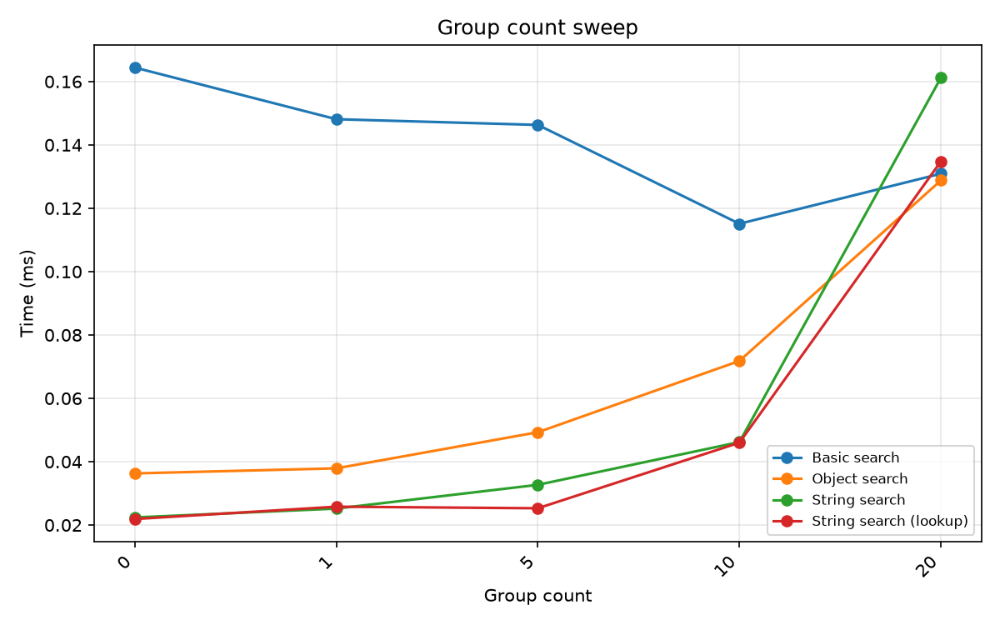

### Nesting Depth

Parenthesisation depth from 0 (flat) to 20. Deeper nesting increases the tree walk for Object search and String search. Basic search sees variable cost because deeper nesting means more delimiter positions for its cartesian-product verification.

|  | Basic search | Object search | String search | String search (lookup) |
| --- | --- | --- | --- | --- |
| 0 | 0.344 | 0.063 | 0.033 | 0.033 |
| 1 | 0.354 | 0.032 | 0.020 | 0.016 |
| 2 | 0.273 | 0.042 | 0.025 | 0.024 |
| 3 | 0.258 | 0.046 | 0.032 | 0.030 |
| 5 | 0.174 | 0.046 | 0.030 | 0.031 |
| 10 | 0.188 | 0.077 | 0.054 | 0.055 |
| 15 | 0.379 | 0.158 | 0.125 | 0.113 |
| 20 | 0.342 | 0.317 | 0.226 | 0.861 |

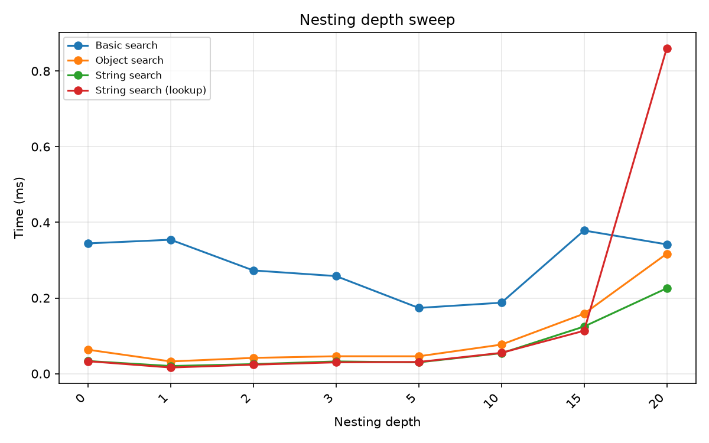

### Per Operation

Individual operation types tested in isolation. Shows which operations are expensive for each engine. basic_search shows NaN/- for unsupported operations.

|  | Basic search | Object search | String search | String search (lookup) |
| --- | --- | --- | --- | --- |
| and_2 | 0.363 | 0.079 | 0.052 | 0.053 |
| and_3 | 0.393 | 0.093 | 0.060 | 0.066 |
| bare_term | 0.277 | 0.060 | 0.027 | 0.030 |
| complex_onset_def | - | 0.070 | 0.050 | 0.040 |
| deep_and_chain | 0.650 | 0.150 | 0.081 | 0.118 |
| descendant_nested | - | 0.055 | 0.036 | 0.027 |
| double_negation | - | 0.077 | 0.049 | 0.048 |
| exact_group_{} | - | 0.075 | 0.043 | 0.046 |
| exact_optional_{:} | - | 0.080 | 0.045 | 0.054 |
| exact_quoted | - | 0.046 | 0.027 | 0.027 |
| negation | 0.099 | 0.047 | 0.031 | 0.030 |
| nested_group_[] | 0.446 | 0.062 | 0.035 | 0.061 |
| nested_or_and | - | 0.120 | 0.074 | 0.074 |
| or | - | 0.073 | 0.042 | 0.045 |
| wildcard_? | - | 0.102 | 0.055 | 0.081 |
| wildcard_?? | - | 0.080 | 0.048 | 0.057 |
| wildcard_??? | - | 0.096 | 0.053 | 0.066 |
| wildcard_prefix | 0.180 | 0.049 | 0.029 | 0.031 |

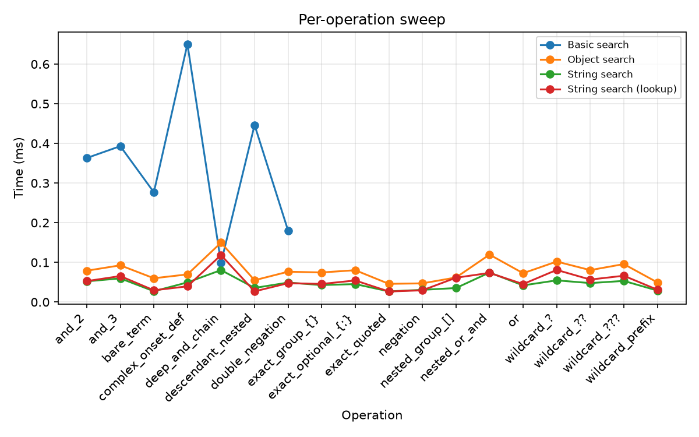

### Query Complexity

Query expression complexity from a bare term to a multi-clause composite. More clauses = more expression-tree nodes to evaluate per candidate.

|  | Basic search | Object search | String search | String search (lookup) |
| --- | --- | --- | --- | --- |
| 1_single_term | 0.208 | 0.113 | 0.077 | 0.067 |
| 2_two_and | 0.260 | 0.100 | 0.073 | 0.060 |
| 3_three_and | 0.327 | 0.098 | 0.062 | 0.061 |
| 4_or | - | 0.182 | 0.091 | 0.059 |
| 5_negation | 0.202 | 0.084 | 0.051 | 0.051 |
| 6_group | 0.187 | 0.097 | 0.062 | 0.066 |
| 7_exact | - | 0.169 | 0.111 | 0.109 |
| 8_complex | - | 0.206 | 0.130 | 0.118 |

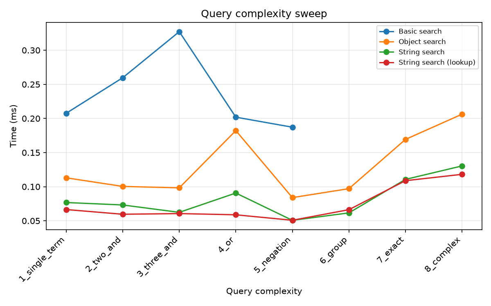

### Repeated Tags

Repetitions of a target tag (0 to 40). Basic search's `verify_search_delimiters` uses `itertools.product` over delimiter positions; repeated tags multiply the search space. Tree-based engines are unaffected.

|  | Basic search | Object search | String search | String search (lookup) |
| --- | --- | --- | --- | --- |
| 0 | 1.136 | 0.043 | 0.030 | 0.035 |
| 3 | 0.920 | 0.083 | 0.071 | 0.045 |
| 5 | 0.660 | 0.074 | 0.041 | 0.041 |
| 10 | 0.515 | 0.164 | 0.117 | 0.113 |
| 20 | 0.616 | 0.226 | 0.123 | 0.178 |
| 40 | 0.492 | 0.326 | 0.223 | 0.344 |

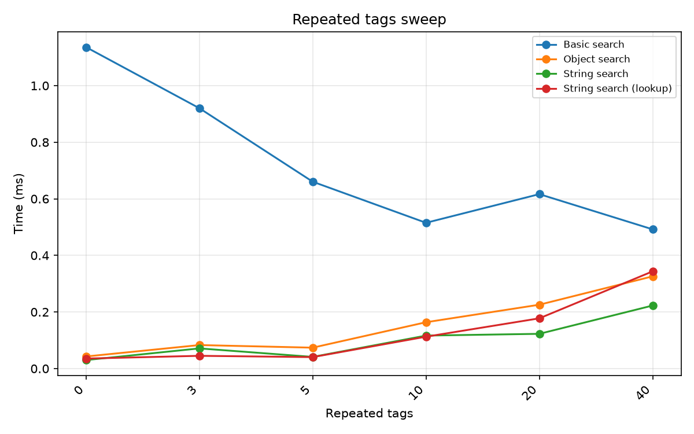

### Schema Lookup

The `schema_lookup` dict (produced by `generate_schema_lookup(schema)`) controls whether string search resolves parent-class queries. Without it, bare terms match only exact tag names - `Event` does **not** match `Sensory-event`. With it, every tag carries its full ancestor path, so `Event` matches any descendant. The table shows timing (ms) and match count on a fixed short-form string containing known Event and Action descendants.

| Query | No lookup: time (ms) | With lookup: time (ms) | No lookup: matches | With lookup: matches |
| --- | --- | --- | --- | --- |
| Ancestor: Event | 0.034 | 0.036 | 0 | 5 |
| Ancestor: Action | 0.032 | 0.037 | 0 | 7 |
| Exact: Sensory-event | 0.023 | 0.020 | 1 | 1 |
| Compound: Event && Action | 0.023 | 0.105 | 0 | 20 |

### Series Size

Number of strings in the list (10 to 5000). basic_search scales sub-linearly thanks to vectorised pandas regex applied to a `pd.Series`. All other engines scale linearly (fixed per-item cost).

|  | Basic search | Object search | String search | String search (lookup) |
| --- | --- | --- | --- | --- |
| 10 | 0.310 | 0.386 | 0.259 | 0.265 |
| 100 | 0.426 | 3.191 | 4.566 | 2.949 |
| 500 | 1.049 | 17.925 | 11.260 | 10.721 |
| 1000 | 2.354 | 35.003 | 21.607 | 21.558 |
| 5000 | 10.723 | 160.984 | 119.369 | 114.326 |

### String Form

Short-form vs long-form HED strings. Long-form strings have fully expanded paths (e.g. `Event/Sensory-event`) and are longer, increasing regex and parse cost.

|  | Basic search | Object search | String search | String search (lookup) |
| --- | --- | --- | --- | --- |
| long | 0.170 | 0.132 | 0.082 | 0.079 |
| short | 0.188 | 0.055 | 0.039 | 0.036 |

### Tag Count

Number of tags in the HED string (1 to 100). Basic search time is dominated by regex compilation overhead and stays roughly constant; tree-based engines scale linearly with the number of nodes to traverse.

|  | Basic search | Object search | String search | String search (lookup) |
| --- | --- | --- | --- | --- |
| 1 | 0.150 | 0.008 | 0.004 | 0.004 |
| 5 | 0.146 | 0.019 | 0.012 | 0.011 |
| 10 | 0.160 | 0.035 | 0.022 | 0.023 |
| 25 | 0.111 | 0.052 | 0.036 | 0.035 |
| 50 | 0.111 | 0.112 | 0.072 | 0.075 |
| 100 | 0.119 | 0.444 | 0.456 | 0.404 |

## Real BIDS data

Search over 200 rows of real BIDS event data (`eeg_ds003645s_hed` test dataset, HED_column values). Times in milliseconds.

|  | Basic search | Object search | String search |
| --- | --- | --- | --- |
| complex_composite | - | 14.019 | 7.298 |
| exact_group | - | 7.131 | 4.939 |
| exact_group_optional | - | 8.758 | 5.971 |
| group_nesting | 0.254 | 8.609 | 4.824 |
| negation | 0.701 | 8.856 | 6.818 |
| single_bare_term | 0.721 | 8.909 | 4.892 |
| single_exact_term | - | 9.190 | 5.646 |
| single_wildcard | 0.606 | 9.671 | 6.749 |
| three_term_and | 1.434 | 12.809 | 5.698 |
| two_term_and | 1.029 | 9.225 | 5.445 |
| two_term_or | - | 7.762 | 5.083 |
| wildcard_child | - | 23.684 | 9.573 |

## Recommendations

**Choose Basic search when:** You need the fastest possible batch search over a `pd.Series`, your queries use only simple terms, AND, negation, or descendant wildcards (`*`), and you don't need schema-aware matching. Ideal for filtering event files where speed matters and queries are simple.

**Choose String search when:** You need the full query language (OR, exact groups, logical groups, wildcards) but want to avoid the overhead of parsing every HED string through the schema. `string_search()` is the best general-purpose option when operating on raw strings from tabular files.

**Choose Object search when:** You already have parsed `HedString` objects (e.g. from validation pipelines), or you need exact schema-validated matching. The additional overhead comes from `HedString` construction, not the search itself.

## Methodology

- **Timing:** `timeit` with 10 iterations (single-string), 3 iterations (list search), 5 iterations (sweeps). Median of all iterations reported.
- **Schema:** HED 8.4.0 loaded once and reused across all benchmarks.
- **Data generation:** Synthetic strings built from real schema tags with controlled tag count, nesting depth, group count, and tag repetition.
- **schema_lookup:** Generated via `generate_schema_lookup(schema)` - a dict mapping each short tag to its ancestor tuple.
- **Environment:** Results depend on hardware; relative ratios between engines are the meaningful comparison.
