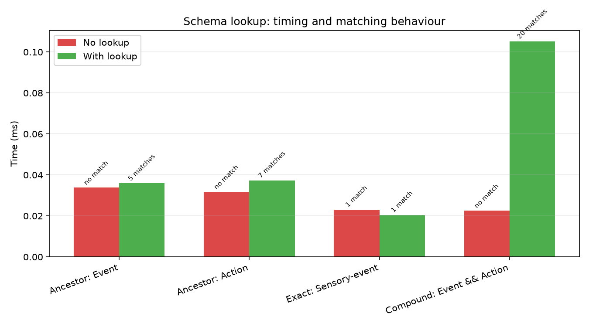
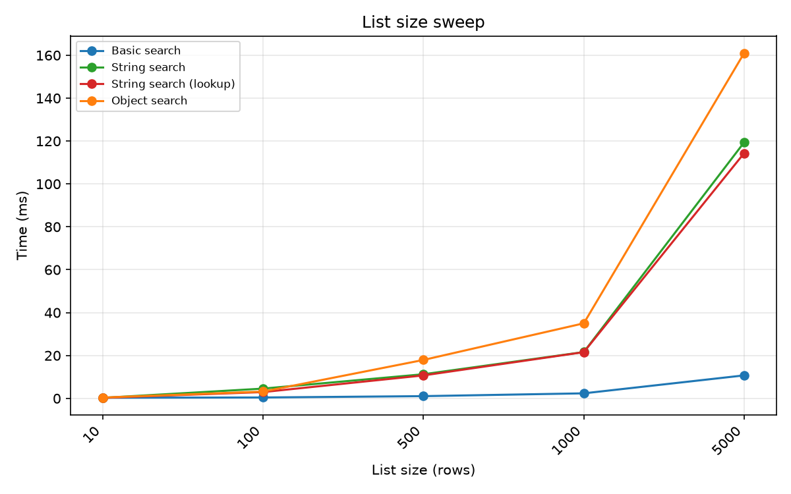
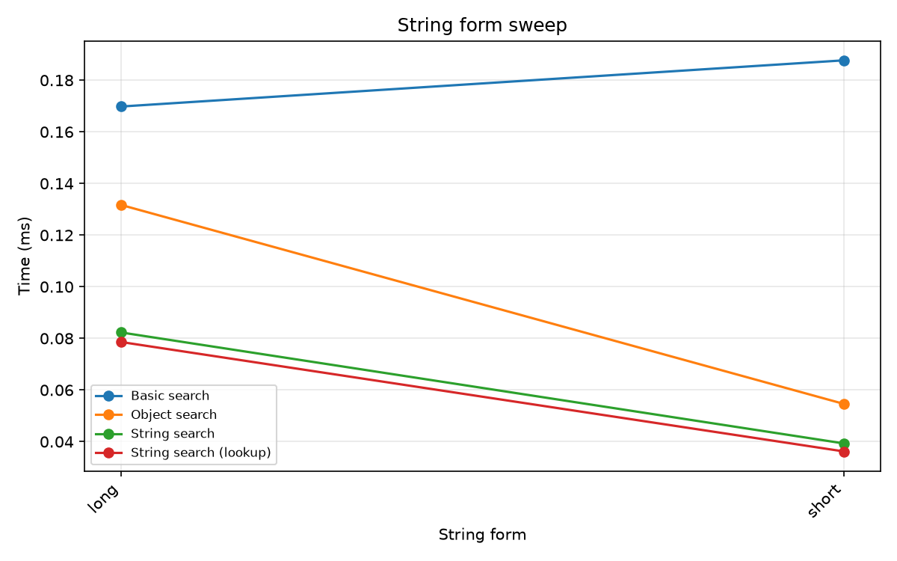
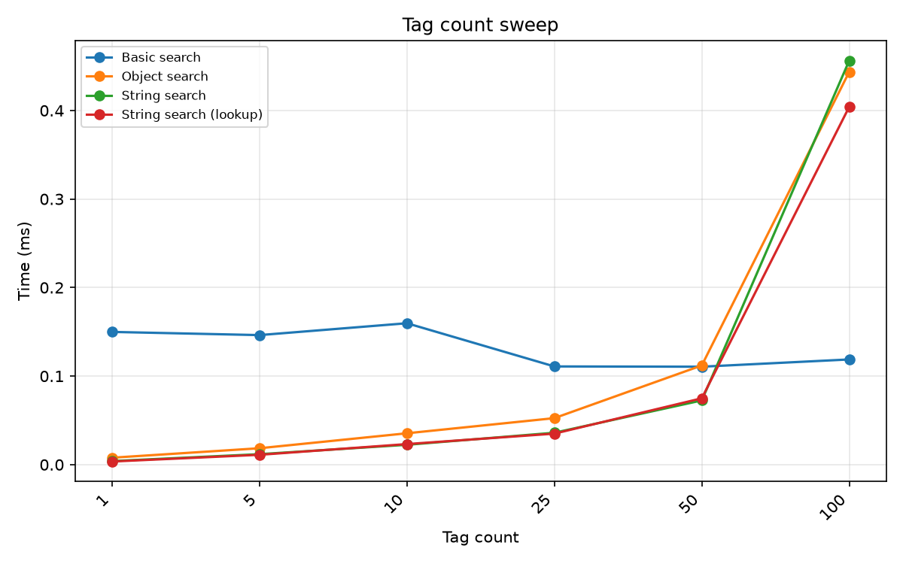
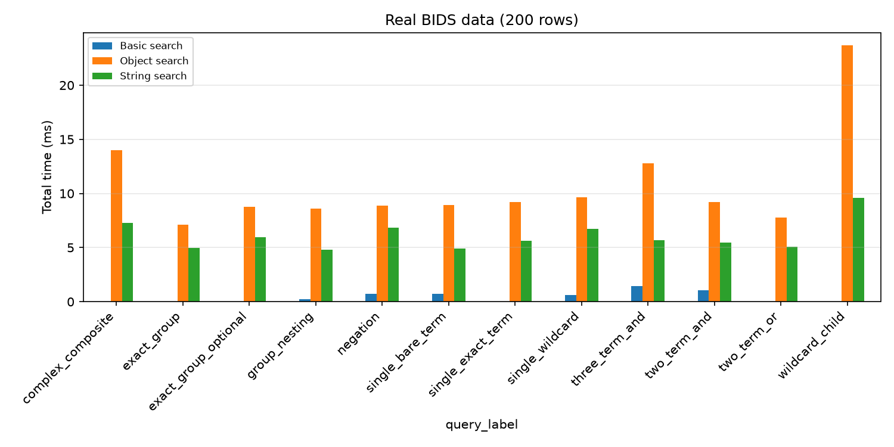

| Query | No lookup: time (ms) | With lookup: time (ms) | No lookup: matches | With lookup: matches |
| --- | --- | --- | --- | --- |
| Ancestor: Event | 0.034 | 0.036 | 0 | 5 |
| Ancestor: Action | 0.032 | 0.037 | 0 | 7 |
| Exact: Sensory-event | 0.023 | 0.020 | 1 | 1 |
| Compound: Event && Action | 0.023 | 0.105 | 0 | 20 |
| Query | No lookup: time (ms) | With lookup: time (ms) | No lookup: matches | With lookup: matches |
| --- | --- | --- | --- | --- |
| Ancestor: Event | 0.034 | 0.036 | 0 | 5 |
| Ancestor: Action | 0.032 | 0.037 | 0 | 7 |
| Exact: Sensory-event | 0.023 | 0.020 | 1 | 1 |
| Compound: Event && Action | 0.023 | 0.105 | 0 | 20 |

### Series Size

Number of strings in the list (10 to 5000). basic_search scales sub-linearly thanks to vectorised pandas regex applied to a `pd.Series`. All other engines scale linearly (fixed per-item cost).

|  | Basic search | Object search | String search | String search (lookup) |
| --- | --- | --- | --- | --- |
| 10 | 0.310 | 0.386 | 0.259 | 0.265 |
| 100 | 0.426 | 3.191 | 4.566 | 2.949 |
| 500 | 1.049 | 17.925 | 11.260 | 10.721 |
| 1000 | 2.354 | 35.003 | 21.607 | 21.558 |
| 5000 | 10.723 | 160.984 | 119.369 | 114.326 |

### String Form

Short-form vs long-form HED strings. Long-form strings have fully expanded paths (e.g. `Event/Sensory-event`) and are longer, increasing regex and parse cost.

|  | Basic search | Object search | String search | String search (lookup) |
| --- | --- | --- | --- | --- |
| long | 0.170 | 0.132 | 0.082 | 0.079 |
| short | 0.188 | 0.055 | 0.039 | 0.036 |

### Tag Count

Number of tags in the HED string (1 to 100). Basic search time is dominated by regex compilation overhead and stays roughly constant; tree-based engines scale linearly with the number of nodes to traverse.

|  | Basic search | Object search | String search | String search (lookup) |
| --- | --- | --- | --- | --- |
| 1 | 0.150 | 0.008 | 0.004 | 0.004 |
| 5 | 0.146 | 0.019 | 0.012 | 0.011 |
| 10 | 0.160 | 0.035 | 0.022 | 0.023 |
| 25 | 0.111 | 0.052 | 0.036 | 0.035 |
| 50 | 0.111 | 0.112 | 0.072 | 0.075 |
| 100 | 0.119 | 0.444 | 0.456 | 0.404 |

## Real BIDS data

Search over 200 rows of real BIDS event data (`eeg_ds003645s_hed` test dataset, HED_column values). Times in milliseconds.

|  | Basic search | Object search | String search |
| --- | --- | --- | --- |
| complex_composite | — | 14.019 | 7.298 |
| exact_group | — | 7.131 | 4.939 |
| exact_group_optional | — | 8.758 | 5.971 |
| group_nesting | 0.254 | 8.609 | 4.824 |
| negation | 0.701 | 8.856 | 6.818 |
| single_bare_term | 0.721 | 8.909 | 4.892 |
| single_exact_term | — | 9.190 | 5.646 |
| single_wildcard | 0.606 | 9.671 | 6.749 |
| three_term_and | 1.434 | 12.809 | 5.698 |
| two_term_and | 1.029 | 9.225 | 5.445 |
| two_term_or | — | 7.762 | 5.083 |
| wildcard_child | — | 23.684 | 9.573 |

## Recommendations

**Choose Basic search when:** You need the fastest possible batch search over a `pd.Series`, your queries use only simple terms, AND, negation, or descendant wildcards (`*`), and you don't need schema-aware matching. Ideal for filtering event files where speed matters and queries are simple.

**Choose String search when:** You need the full query language (OR, exact groups, logical groups, wildcards) but want to avoid the overhead of parsing every HED string through the schema. `string_search()` is the best general-purpose option when operating on raw strings from tabular files.

**Choose Object search when:** You already have parsed `HedString` objects (e.g. from validation pipelines), or you need exact schema-validated matching. The additional overhead comes from `HedString` construction, not the search itself.

## Methodology

- **Timing:** `timeit` with 10 iterations (single-string), 3 iterations (list search), 5 iterations (sweeps). Median of all iterations reported.
- **Schema:** HED 8.4.0 loaded once and reused across all benchmarks.
- **Data generation:** Synthetic strings built from real schema tags with controlled tag count, nesting depth, group count, and tag repetition.
- **schema_lookup:** Generated via `generate_schema_lookup(schema)` — a dict mapping each short tag to its ancestor tuple.
- **Environment:** Results depend on hardware; relative ratios between engines are the meaningful comparison.
